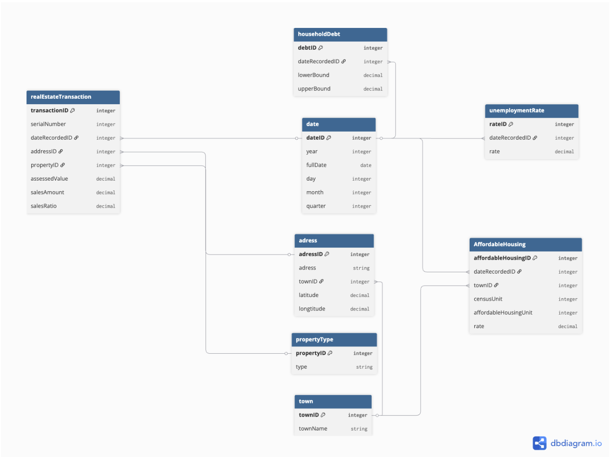

# Connecticut Real Estate Data Pipeline Project

## 1. Summary
The goal of this project is to build a foundational data processing and modeling workflow that extracts, cleans, and structures over two decades of Connecticut real estate transactions alongside macroeconomic indicators.

By designing a Galaxy Schema and configuring a Headless BI Semantic Layer, this project bridges the granularity gap between daily property sales with economic metrics, which have different granularity (e.g. unemployment is quarterly). The resulting data model prepares the raw data for modern BI tools without requiring analysts to write complex, multi-pass SQL.

Ultimately, this structured data model supports three core analytical use cases:
* Identifying potentially undervalued properties based on sales ratios.
* Observing municipal tax assessment trends.
* Tracking the correlation between the broader macro-economy and local housing volumes.

## 2. Implementation
This project mirrors modern, scalable data engineering workflows.
* **Data cleaning and transformation (Python/Pandas):** Built an Object-Oriented Python ETL script to extract raw CSVs, handle null values, standardize data types, generate surrogate keys and so on. 
* **Data Storage (PostgreSQL):** Deployed a relational database to serve as the central repository. Rather than keeping the data in its raw, flat format, I structured it using a dimensional model (Galaxy Schema) to specifically support analytical querying and BI reporting.
* **Semantic Layer (Cube.dev):** Implemented a Headless BI layer using YAML to govern business metrics and serve consistent, ready-to-use data to analysts via modern BI tools.

## 3. Business questions (The "Why")
The architecture was built specifically to answer these core business questions:
* **Macroeconomic Impact:** How do broader economic factors (e.g., state-wide unemployment rates, affordable housing initiatives) influence the volume and pricing of local real estate transactions over a 20-year timeline?
* **Market Opportunity (Investor View):** Can we automatically categorize properties as "Hot" or "Cold" investments by tracking the divergence between Assessed Value and actual Sale Price (Sales Ratio)?
* **Risk & Anomaly Detection:** How can we flag non-market or suspicious transactions (e.g., family transfers or foreclosures) that distort market analytics?

## 4. Brief Descriptions of the Raw Datasets used
* **Real Estate Transactions:** Daily logs of individual property sales across Connecticut. It includes granular details like the exact address, town, sale amount, government-assessed value, and property type.
* **Unemployment:** Quarterly time-series data showing the absolute headcount of unemployed individuals in the state (e.g., 98,300).
* **Household Debt:** Quarterly economic data tracking the estimated lower and upper bounds of household debt-to-income ratios, mapped by state geographic area codes.
* **Affordable Housing:** Annual records for each Connecticut town detailing the total census housing units versus government-assisted (affordable) units.

## 5. Data Architecture: The Galaxy Schema
To handle varying levels of data granularity (daily sales vs. monthly unemployment), I implemented a Galaxy Schema. Here’s an ERD, along with descriptions of the attributes and entities.

### Dimensions: 
**1. `date` (Time Dimension)**
* `date_id` (Integer, PK): Surrogate primary key serving as the routing anchor for all fact tables.
* `full_date` (Date): The standard calendar date (YYYY-MM-DD).
* `year`, `quarter`, `month`, `day` (Integer): Standard temporal hierarchies enabling drill-down and roll-up aggregations across mixed-grain datasets.

**2. `address` (Spatial Dimension)**
* `address_id` (Integer, PK): Surrogate primary key uniquely identifying a physical location.
* `address` (String): The raw, standardized physical street address of the property.
* `town_id` (Integer, FK): Links out to the town dimension, creating a slightly snowflaked spatial hierarchy.
* `latitude` & `longitude` (Decimal): Geocoded spatial coordinates mapped via Python to enable interactive, map-based BI visualizations.

**3. `town` (The Geographic Dimension)**
* `town_id` (Integer, PK): Surrogate primary key.
* `town_name` (String): The standardized geographic name of the Connecticut municipality.

**4. `property_type` (The Classification Dimension)**
* `property_id` (Integer, PK): Surrogate primary key.
* `type` (String): Categorical classification of the real estate asset (e.g., Single Family, Commercial, Condo).

### Fact Tables:
**1. `real_estate_transaction` (Grain: Daily per Property)**
* `transaction_id` (Integer, PK): Surrogate primary key uniquely identifying each real estate sale.
* `serial_number` (Integer): The official municipal tracking number for the property transaction.
* `date_recorded_id` (Integer, FK): Links to the date dimension representing the exact day the sale was finalized.
* `address_id` (Integer, FK): Links to the spatial address dimension.
* `property_id` (Integer, FK): Links to the property_type classification.
* `assessed_value` (Decimal): The local government's appraised value of the property used for tax purposes.
* `sales_amount` (Decimal): The actual market price paid by the buyer.
* `sales_ratio` (Decimal): Calculated metric (`assessed_value` / `sales_amount`). This is the core business logic used to categorize properties as undervalued, overvalued, or market rate.

**2. `unemployment_rate` (Grain: Quarterly per State)**
* `rate_id` (Integer, PK): Surrogate primary key.
* `date_recorded_id` (Integer, FK): Links to the date dimension.
* `rate` (Decimal): The raw absolute headcount of unemployed residents. *(Note: To ensure accurate BI reporting, this headcount is dynamically calculated into an Unemployment Percentage within the Cube.dev semantic layer).*

**3. `household_debt` (Grain: Quarterly per State)**
* `debt_id` (Integer, PK): Surrogate primary key.
* `date_recordedID` (Integer, FK): Links to the date dimension.
* `lower_bound` (Decimal): The estimated minimum median household debt-to-income ratio.
* `upper_bound` (Decimal): The estimated maximum median household debt-to-income ratio, acting as a macroeconomic indicator of consumer financial health.

**4. `affordable_housing` (Grain: Annual per Town)**
* `affordable_housing_id` (Integer, PK): Surrogate primary key.
* `date_recorded_id` (Integer, FK): Links to the date dimension.
* `town_id` (Integer, FK): Links to the town dimension to establish geographic impact.
* `census_unit` (Integer): Total housing units tracked by the census in municipality.
* `affordable_housing_unit` (Integer): Total number of government-assisted affordable dwellings.
* `rate` (Decimal): The percentage of the town's total housing stock designated as affordable.

## 6. Key Engineering Challenges Solved

**1. Building a Python ETL Pipeline**
Instead of writing a basic, top-to-bottom script, I built the Python data processing step using a modular approach. By separating the extraction, cleaning, and loading phases into distinct functions, the code is clean, organized.

**2. Cleaning 1.1 Million Rows of Data** The raw real estate dataset contained over 1.1 million rows with missing values and inconsistent text. Using Pandas, I wrote transformations to clean the data before it reached the database. This meant fixing date formats, handling blank financial records, and standardizing town names so they would join perfectly with the affordable housing dataset.

**3. Using Surrogate Keys to Speed Up Queries** In the raw data, entities like "Address" or "Town" were just text strings. Joining 1.1 million rows using long text strings is slow and uses a lot of database memory. To fix this, my Python script generates unique integer IDs (Surrogate Keys) for all the dimension tables. 

Using integers instead of text makes the PostgreSQL database much faster and saves storage space.

**4. Solving the Mixed-Grain Join Problem** Joining daily real estate sales directly to quarterly unemployment data usually causes massive data duplication (known as a fan-out error). 

To prevent this, I used Cube as a Semantic Layer. I configured it to connect both datasets safely through a shared `dim_date` table. This means the system correctly aggregates the daily sales and the quarterly data separately before joining them, keeping the math 100% accurate.

**5. Calculating Business Metrics on the Fly** The raw unemployment data only provided a total headcount (e.g., 98,300 people), not a percentage rate. Instead of permanently hardcoding a percentage into the database, I built a dynamic calculation inside the Semantic Layer. Because a dataset with the exact historical labor force was unavailable, I used a static proxy of 1.9 million (Connecticut's historical average) to calculate the Unemployment Percentage on the fly (`Headcount / 1.9M * 100`). While this works perfectly for this project's scope, in a true production environment, the next step would be to ingest a dedicated labor force dataset to make this denominator fully dynamic.

## 7. Delivery and insights
The main goal of this project wasn't just to fill a database, but to make the data easy to connect to a visualization dashboard. By using Cube in the middle, I hid the complex database structure from the end-user.

As shown in the chart below, a Data Analyst or a BI tool (like Tableau or Power BI) can now easily use this setup to derive insights from the data. Cube handles all the complicated math and joins behind the scenes. This proves that the pipeline successfully delivers clean, ready-to-use data without requiring anyone to write complicated SQL queries.

## Sources: 
* **Real-estate dataset:** [Data.gov - Real Estate Sales 2001-2018](https://catalog.data.gov/dataset/real-estate-sales-2001-2018)
* **Unemployment dataset:** [FRED - UNEMPLOYCT](https://fred.stlouisfed.org/series/UNEMPLOYCT)
* **Affordable housing dataset:** [Data.gov - Affordable Housing by Town](https://catalog.data.gov/dataset/affordable-housing-by-town-2011-present)
* **Household debt dataset:** [Data.gov - Household Debt by State](https://catalog.data.gov/dataset/household-debt-by-state-county-and-msa)
